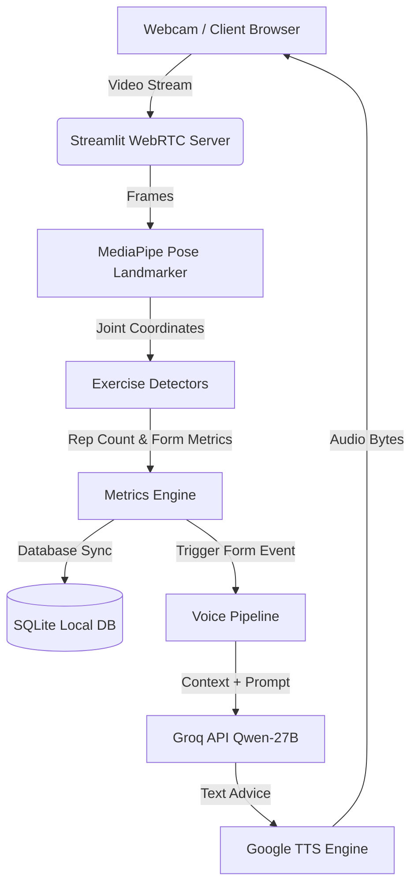

# 🏋️‍♂️ GymGuru AI: Real-Time Pose Detection & AI Voice Coach

GymGuru AI is a web-based, real-time fitness companion built with **Python**, **MediaPipe**, **Streamlit-WebRTC**, and **Groq LLM**. It utilizes computer vision to analyze your workouts through your webcam, counts your reps and sets, checks your exercise posture/form, and provides proactive voice corrections in real-time.

---

## 📺 Project Demo Video / Interface Screenshot

> [!TIP]
> *Add your demo video file or screenshot below by replacing the placeholder:*

<!-- REPLACE THIS LINE WITH YOUR DEMO VIDEO/IMAGE LINK -->
```
                   [ PLACE YOUR DEMO VIDEO / IMAGE HERE ]
    (e.g., )
```

---

## 🚀 Key Features

* **Real-Time Pose Tracking**: Leverages MediaPipe's high-performance pose landmark model to track 33 body coordinates in real time.
* **Proactive Voice Coaching**: Powered by **Groq's Qwen-27B LLM** and **Google Text-to-Speech (gTTS)**, the coach speaks out loud to correct your form, motivate you, and celebrate set completions.
* **Smart Posture Checking**: Instantly detects specific joint alignments, hip sagging, back arching, elbow drifts, and balance status across multiple exercises.
* **Workout History Tracker**: Automatically logs your performance (sets, reps, active time) to a local SQLite database and displays a visual history summary in a table.
* **Seamless Streaming**: Powered by `streamlit-webrtc` to support smooth web-based video processing with low latency.
* **Modern Dark UI**: Features customized styling, custom font layouts, and responsive panels for clean visuals.

---

## 🏗️ System Architecture

This diagram shows how video frames flow from your webcam to the pose analyzer and then trigger the AI Voice Coach:



---

## 🏃 Supported Exercises & Form Corrections

| Exercise | Joints Monitored | Form Issues Checked & Corrected |
| :--- | :--- | :--- |
| **Squats** | Hips, Knees, Ankles, Shoulders | Not squatting deep enough, leaning too far forward |
| **Push-ups** | Elbows, Shoulders, Hips, Ankles | Body alignment issues, sagging hips, piked-up hips |
| **Bicep Curls** | Shoulders, Elbows, Wrists, Torso | Torso swinging/cheating, elbow drifting from the sides |
| **Shoulder Press** | Shoulders, Elbows, Wrists, Lower Back | Excessive back arching, incomplete arm extension |
| **Lunges** | Hips, Knees, Ankles | Knee over toe alignment, loss of balance |

---

## 🛠️ Tech Stack

* **Frontend & Web Server**: Streamlit, HTML5, Custom CSS
* **Computer Vision**: Mediapipe, OpenCV (Headless)
* **AI Intelligence**: Groq API (`qwen/qwen3.8-27b` model)
* **Speech Processing**: Google Text-to-Speech (`gtts`)
* **Database**: SQLite3, Pandas
* **Environment**: Python 3.12+, `python-dotenv`

---

## ⚙️ Getting Started & Local Setup

### Prerequisites
Make sure you have Python 3.12+ and `uv` (recommended) or `pip` installed.

### 1. Clone the Repository
```bash
git clone https://github.com/HariomGupta0/AI_Gym_Buddy.git
cd AI_Gym_Buddy
```

### 2. Configure Environment Variables
Create a `.env` file in the root directory:
```env
GROQ_API_KEY=your_groq_api_key_here
```
*(Your `.env` file is protected locally and ignored by Git automatically).*

### 3. Create a Virtual Environment & Install Dependencies

**Using `uv` (Recommended):**
```powershell
uv pip install -r requirements.txt
```

**Using Standard Virtualenv:**
```powershell
python -m venv .venv
.venv\Scripts\Activate.ps1
pip install -r requirements.txt
```

---

## 🚦 Running the Application

Since virtual environments on Windows sometimes have wrapper resolution issues with Streamlit, launch the app directly through Python:

```powershell
# Make sure your virtual environment is active (.venv)
python -m streamlit run main.py
```
Open `http://localhost:8501` in your web browser and start training!

---

## 📂 Project Structure

```
├── core/
│   └── base_exercise.py          # Abstract base class for workout detectors
├── detectors/
│   ├── pushup.py                 # Push-up angle analysis logic
│   ├── squat.py                  # Squat angle analysis logic
│   ├── biceps_curls.py           # Biceps curls angle analysis logic
│   ├── shoulder_press.py         # Shoulder press angle analysis logic
│   └── lunges.py                 # Lunges angle analysis logic
├── ml_models/
│   └── pose_landmarker_full.task # MediaPipe pose tracking model weights
├── services/
│   ├── auth/                     # User registration & login wall screens
│   ├── coaching/                 # Groq client integration & TTS engines
│   ├── persistence/              # SQLite DB integration
│   ├── state/                    # Default Streamlit session values
│   ├── tracking/                 # Real-time metrics tracking/updating
│   ├── ui/                       # Stylesheets loader & responsive injects
├── static/
│   ├── style.css                 # Custom CSS overrides for Streamlit
│   └── AdobeClean.otf            # Project local font
├── main.py                       # Main application script
├── .gitignore                    # Git rules to hide keys & pycache
└── requirements.txt              # Project packages
```

---

## 📄 License
Distributed under the MIT License. See `LICENSE` for more information.
